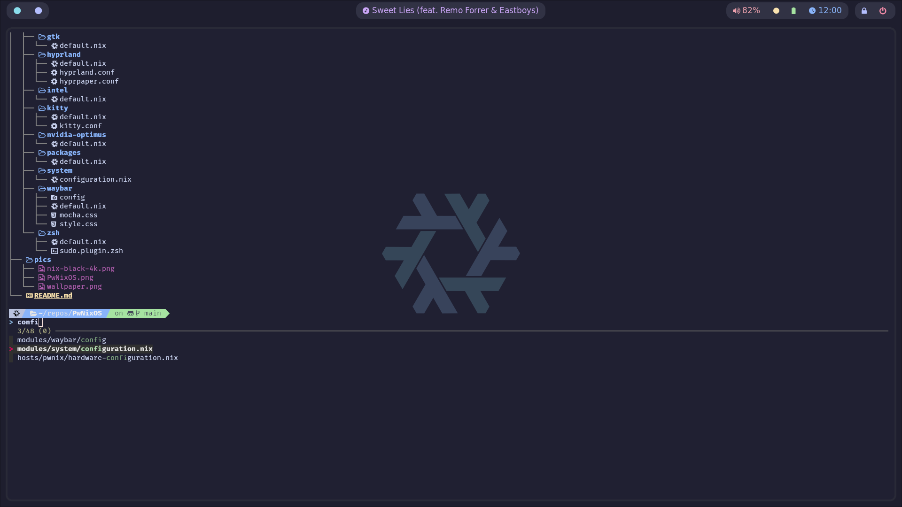
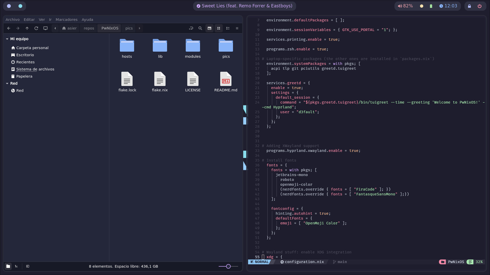
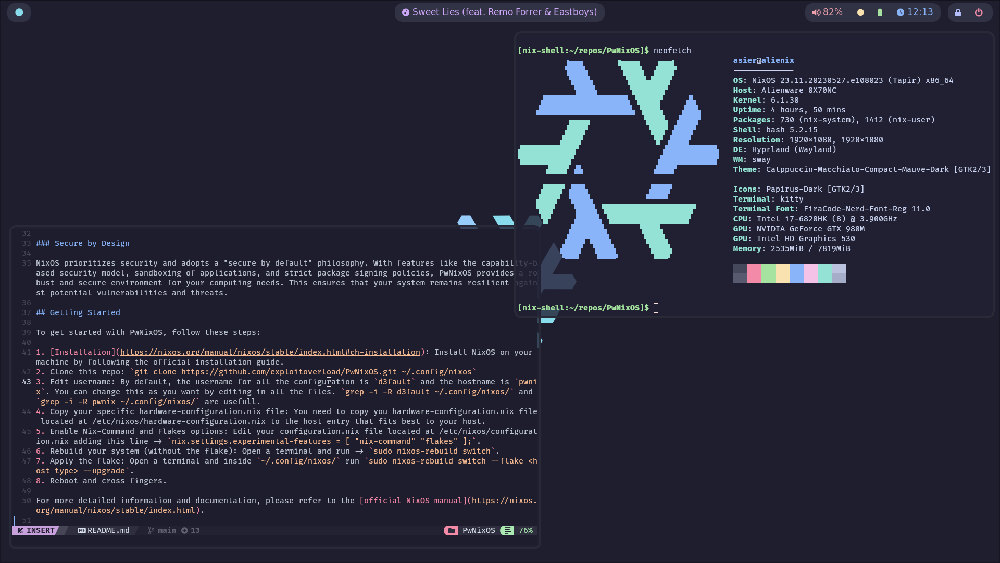

# PwNixOS: A Graphical-Centric and Hacking-Oriented NixOS Flake 

## Introduction

Welcome to PwNixOS, a NixOS Flake that combines a strong focus on productivity with powerful tools for hacking. 

## Screenshots

## Features

### UnixPorn at its core

PwNixOS places a strong emphasis on delivering a top-notch graphical experience by providing a visually appealing and productivity-focused interface. 

### Hacking Tools

PwNixOS offers a wide array of tools and utilities out of the box to support your hacking endeavors. From advanced network analysis and penetration testing tools to powerful scripting languages and development environments, PwNixOS equips you with the necessary arsenal to explore and manipulate computer systems to your heart's content. 

### Package Management with Nix

One of the standout features of NixOS is its unique package management system called Nix. With Nix, you can easily install, update, and manage software packages on your system. What makes Nix special is its ability to provide isolated and reproducible environments for each package, ensuring that software installations do not interfere with one another. This allows for painless experimentation and easy rollback to previous configurations.

### Declarative Configuration

NixOS follows a declarative approach to system configuration. Instead of making changes directly to the system, you define the desired state of your system in a configuration file or flake (like this one). This configuration specifies all the packages, services, and settings you want, providing a clear and reproducible blueprint for your system. This declarative nature simplifies system administration, enables easy replication of configurations across multiple machines, and facilitates version control of your system setup.

### Secure by Design

NixOS prioritizes security and adopts a "secure by default" philosophy. With features like the capability-based security model, sandboxing of applications, and strict package signing policies, PwNixOS provides a robust and secure environment for your computing needs. This ensures that your system remains resilient against potential vulnerabilities and threats.

## Getting Started

To get started with PwNixOS, follow these steps:

1. [Installation](https://nixos.org/manual/nixos/stable/index.html#ch-installation): Install NixOS on your machine by following the official installation guide.
2. Clone this repo: `git clone https://github.com/exploitoverload/PwNixOS.git ~/.config/nixos`
3. Edit username: By default, the username for all the configuration is `d3fault` and the hostname is `pwnix`. You can change this as you want by editing in all the files (don't forget to rename the folder inside hosts). `grep -i -R d3fault ~/.config/nixos/` and `grep -i -R pwnix ~/.config/nixos/` are usefull.
4. Copy your specific hardware-configuration.nix file: You need to copy you hardware-configuration.nix file located at /etc/nixos/hardware-configuration.nix to the host entry that fits best to your host.
5. Enable Nix-Command and Flakes options: Edit your configuration.nix file located at /etc/nixos/configuration.nix adding this line -> `nix.settings.experimental-features = [ "nix-command" "flakes" ];`.
6. Rebuild your system (without the flake): Open a terminal and run -> `sudo nixos-rebuild switch`. 
7. Apply the flake: Open a terminal and inside `~/.config/nixos/` run `sudo nixos-rebuild boot --flake <host type> --upgrade`.
8. Reboot and cross fingers.

## TODO

- [ ] Add [NvChad](https://github.com/NvChad/NvChad) to the neovim configuration.
- [ ] Add IP Addresses for current interface to waybar with clip to copy. 

For more detailed information and documentation, please refer to the [official NixOS manual](https://nixos.org/manual/nixos/stable/index.html).

## Special thanks to:

* [Notusknot dotfiles](https://github.com/notusknot/dotfiles-nix)
* [Catppuccin theme](https://github.com/catppuccin/catppuccin)
* [Rubyowo dotfiles](https://github.com/rubyowo/dotfiles)
